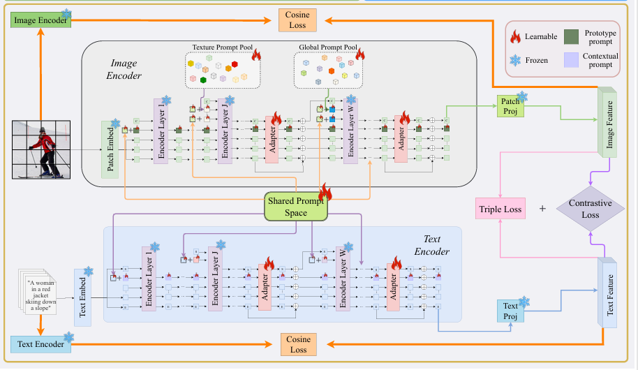

# PIHM

# Abstract
Large vision-language models (VLMs) have demonstrated significant potential for cross-modal matching scenarios. However, directly applying VLMs to downstream image-text retrieval (ITR) tasks requires either tuning a huge number of parameters, consuming enormous computational resources, or adopting a simple prompt learning mechanism that fails to capture hierarchical semantic correspondences between modalities. To address these challenges, we propose Prototype-Informed Hierarchical Modulation for Vision-Language Adaptation (termed PIHM). PIHM devises a hierarchical prompting strategy, where distinct prompts are inserted into different layers of VLMs: prompts in intermediate layers are designed to focus on fine-grained texture details, while prompts in deeper layers capture global semantic information. This design guarantees both the efficiency and diversity of prompt parameters, enabling the model to effectively fit complex cross-modal data distributions. We conduct extensive experiments on various ITR benchmarks including general natural scenes (MSCOCO and Flickr30K) and specialized remote sensing scenarios (UCM-Captions, RSICD and RSITMD). Experimental results verify that our PIHM can achieve much higher performance with lower model complexity than state-of-the-art methods. Take Flickr30K for example, PIHM trained with only 30\% data achieves significantly superior performance compared to strong baselines trained with 100\% data, providing a highly efficient solution for resource-constrained scenarios. More importantly, PIHM consistently exhibits strong generalization capability across diverse cross-dataset and cross-domain scenarios.
# Framework

# Setup

python >= 3.9

pip install torch==2.0.1 torchvision==0.15.2 torchaudio==2.0.2 --index-url https://download.pytorch.org/whl/cu118

pip install -r requirements.txt

# Training

python train.py --config-name=config-name --dataset_name=datasetname

# Evaluation

cd /PIHM/eval

python eval_coco.py

python eval_flickr.py

